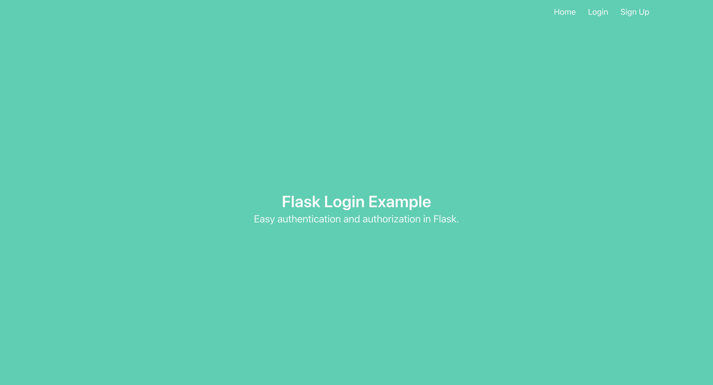

# COMP3310 Authentication
Code for Authentication workshop task.
This task uses python and flask to create a simple login form. The code for this form is sourced from https://www.digitalocean.com/community/tutorials/how-to-add-authentication-to-your-app-with-flask-login

For this task you will need to have the following installed:

- python3
- pip

If you have a Windows 10 machine, you can follow instructions on installing Python here: https://www.digitalocean.com/community/tutorials/install-python-windows-10 

Pip is the package manager for Python.  You can install the remaining packages required for this task using pip. You will need to run the following:

- pip install flask flask-sqlalchemy flask-login

(NOTE: If you are using a Mac you may need to use the command pip3 instead of pip to ensure you are installing packages for python3)

You should have at least the following versions installed: 
- Python             3.9.6
- Flask              2.2.3
- Flask-Login        0.6.2
- Flask-SQLAlchemy   3.0.3

You will also need sqlite installed for the database backend.

# Initialising the database

You should first initialise the database as follows:
- python initialise_db.py

This should create an sqlite database under the instance directory. You can view the contents of the database using the sqlite command line interface as follows:

sqlite3 instance/db.sqlite
> .schema  
CREATE TABLE user (
	id INTEGER NOT NULL, 
	email VARCHAR(100), 
	password VARCHAR(100), 
	name VARCHAR(1000), 
	PRIMARY KEY (id), 
	UNIQUE (email)
);
> select * from user;
>

You should see that there are no users in the database. 

# Run the website

You can run the website by typing:

- python run.py

(If you are using a Mac you may need to type python3 run.py).

You can now browse to the url http://localhost:8001/ and you should see the home page for the website.

the-Silverlode:workshop-8-authentication-AidenYoung7701 aiden$ 
the-Silverlode:workshop-8-authentication-AidenYoung7701 aiden$ 
the-Silverlode:workshop-8-authentication-AidenYoung7701 aiden$ sqlite3
SQLite version 3.16.0 2016-11-04 19:09:39
Enter ".help" for usage hints.
Connected to a transient in-memory database.
Use ".open FILENAME" to reopen on a persistent database.
sqlite> python3 initialise_db.py
   ...> sqlite3 instance/db.sqlite
   ...> ^C^Cthe-Silverlode:workshop-8-authentication-AidenYoung7701 aiden$ python initialise_db.py
Traceback (most recent call last):
  File "initialise_db.py", line 1, in <module>
    from project import db, create_app, models
  File "/Users/aiden/Documents/workshop-8-authentication-AidenYoung7701/project/__init__.py", line 1, in <module>
    from flask import Flask
ImportError: No module named flask
the-Silverlode:workshop-8-authentication-AidenYoung7701 aiden$ sqlite3 instance/db.sqlite
SQLite version 3.16.0 2016-11-04 19:09:39
Enter ".help" for usage hints.
sqlite> .schema
Error: unable to open database "instance/db.sqlite": unable to open database file
CREATE TABLE user ( id INTEGER NOT NULL, email VARCHAR(100), password VARCHAR(100), name VARthe-Silverlode:workshop-8-authentication-AidenYoung7701 aiden$ CREATE TABLE RIMARY KEY (id), UNIQUE (email) ); select * from user;rd VARCHAR(100), name VARCHAR(1000), P 
bash: syntax error near unexpected token `('
the-Silverlode:workshop-8-authentication-AidenYoung7701 aiden$ 
the-Silverlode:workshop-8-authentication-AidenYoung7701 aiden$ python3 run.py
 * Serving Flask app 'project'
 * Debug mode: on
WARNING: This is a development server. Do not use it in a production deployment. Use a production WSGI server instead.
 * Running on all addresses (0.0.0.0)
 * Running on http://127.0.0.1:8001
 * Running on http://10.129.0.50:8001
Press CTRL+C to quit
 * Restarting with stat
 * Debugger is active!
 * Debugger PIN: 116-366-391
127.0.0.1 - - [24/Apr/2023 11:56:26] "GET / HTTP/1.1" 200 -
127.0.0.1 - - [24/Apr/2023 11:56:28] "GET /favicon.ico HTTP/1.1" 404 -
127.0.0.1 - - [24/Apr/2023 11:56:34] "GET / HTTP/1.1" 200 -
127.0.0.1 - - [24/Apr/2023 11:56:43] "GET / HTTP/1.1" 200 -
127.0.0.1 - - [24/Apr/2023 11:56:48] "GET /login HTTP/1.1" 200 -
127.0.0.1 - - [24/Apr/2023 11:56:51] "GET / HTTP/1.1" 200 -
127.0.0.1 - - [24/Apr/2023 11:56:52] "GET /login HTTP/1.1" 200 -
127.0.0.1 - - [24/Apr/2023 11:56:53] "GET /signup HTTP/1.1" 200 -
127.0.0.1 - - [24/Apr/2023 11:56:53] "GET /login HTTP/1.1" 200 -
127.0.0.1 - - [24/Apr/2023 11:56:54] "GET / HTTP/1.1" 200 -
127.0.0.1 - - [24/Apr/2023 11:56:55] "GET /signup HTTP/1.1" 200 -
127.0.0.1 - - [24/Apr/2023 11:56:55] "GET /login HTTP/1.1" 200 -
127.0.0.1 - - [24/Apr/2023 11:56:56] "GET /signup HTTP/1.1" 200 -
127.0.0.1 - - [24/Apr/2023 11:56:57] "GET / HTTP/1.1" 200 -
